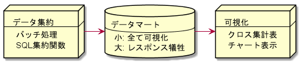
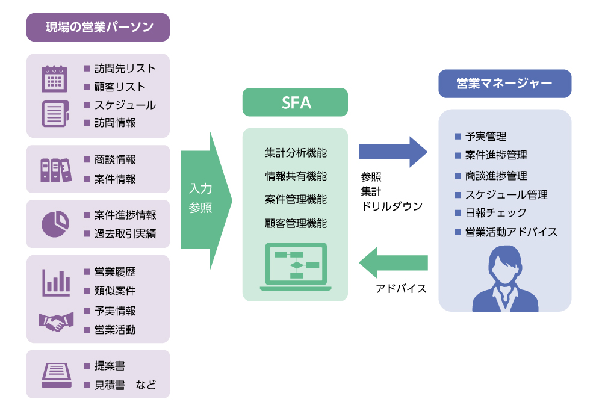
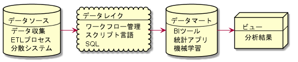

# BIアーキテクチャ

- [BIアーキテクチャ](#bi%E3%82%A2%E3%83%BC%E3%82%AD%E3%83%86%E3%82%AF%E3%83%81%E3%83%A3)
  - [使うもの](#%E4%BD%BF%E3%81%86%E3%82%82%E3%81%AE)
  - [概念](#%E6%A6%82%E5%BF%B5)
    - [ETL処理](#etl%E5%87%A6%E7%90%86)
    - [Operational Data Source (ODS)](#operational-data-source-ods)
    - [データウェアハウス (DWH)](#%E3%83%87%E3%83%BC%E3%82%BF%E3%82%A6%E3%82%A7%E3%82%A2%E3%83%8F%E3%82%A6%E3%82%B9-dwh)
    - [データマート (DM)](#%E3%83%87%E3%83%BC%E3%82%BF%E3%83%9E%E3%83%BC%E3%83%88-dm)
    - [データレイク](#%E3%83%87%E3%83%BC%E3%82%BF%E3%83%AC%E3%82%A4%E3%82%AF)
    - [分散データ処理](#%E5%88%86%E6%95%A3%E3%83%87%E3%83%BC%E3%82%BF%E5%87%A6%E7%90%86)
    - [多次元データベース](#%E5%A4%9A%E6%AC%A1%E5%85%83%E3%83%87%E3%83%BC%E3%82%BF%E3%83%99%E3%83%BC%E3%82%B9)
    - [多次元モデル](#%E5%A4%9A%E6%AC%A1%E5%85%83%E3%83%A2%E3%83%87%E3%83%AB)
      - [OLAP のデータ分析処理](#olap-%E3%81%AE%E3%83%87%E3%83%BC%E3%82%BF%E5%88%86%E6%9E%90%E5%87%A6%E7%90%86)
    - [アドホック分析](#%E3%82%A2%E3%83%89%E3%83%9B%E3%83%83%E3%82%AF%E5%88%86%E6%9E%90)
    - [基幹系と情報系のシステムの違いについて](#%E5%9F%BA%E5%B9%B9%E7%B3%BB%E3%81%A8%E6%83%85%E5%A0%B1%E7%B3%BB%E3%81%AE%E3%82%B7%E3%82%B9%E3%83%86%E3%83%A0%E3%81%AE%E9%81%95%E3%81%84%E3%81%AB%E3%81%A4%E3%81%84%E3%81%A6)
    - [確証的データ解析と探索的データ解析](#%E7%A2%BA%E8%A8%BC%E7%9A%84%E3%83%87%E3%83%BC%E3%82%BF%E8%A7%A3%E6%9E%90%E3%81%A8%E6%8E%A2%E7%B4%A2%E7%9A%84%E3%83%87%E3%83%BC%E3%82%BF%E8%A7%A3%E6%9E%90)
    - [データの可視化と集約](#%E3%83%87%E3%83%BC%E3%82%BF%E3%81%AE%E5%8F%AF%E8%A6%96%E5%8C%96%E3%81%A8%E9%9B%86%E7%B4%84)
      - [データ処理の時間](#%E3%83%87%E3%83%BC%E3%82%BF%E5%87%A6%E7%90%86%E3%81%AE%E6%99%82%E9%96%93)
        - [メモリに全て展開する](#%E3%83%A1%E3%83%A2%E3%83%AA%E3%81%AB%E5%85%A8%E3%81%A6%E5%B1%95%E9%96%8B%E3%81%99%E3%82%8B)
        - [圧縮と分散を駆使する](#%E5%9C%A7%E7%B8%AE%E3%81%A8%E5%88%86%E6%95%A3%E3%82%92%E9%A7%86%E4%BD%BF%E3%81%99%E3%82%8B)
    - [ビジネス用語](#%E3%83%93%E3%82%B8%E3%83%8D%E3%82%B9%E7%94%A8%E8%AA%9E)
      - [SFA (Sales Force Automation)](#sfa-sales-force-automation)
  - [データ分析での役割](#%E3%83%87%E3%83%BC%E3%82%BF%E5%88%86%E6%9E%90%E3%81%A7%E3%81%AE%E5%BD%B9%E5%89%B2)

## 使うもの

- 書籍
  - BIシステム構築実践入門
    - 平井明夫 著
    - 翔泳社
  - ビッグデータを支える技術
    - 西田圭介 著
    - 技術評論社

----

## 概念

### ETL処理

>ETL = Extract, Transform, Load

以前までは変換・加工 → ロード の順番が鉄則だったが、  
最近では

>ELT = Extract, Load, Transform

の順番で行う場合もある（クラウドベースでは）

参考：  
[ETL処理とELT処理の違い ～ビッグデータ処理の新トレンド～ _ GiXo Ltd.](https://www.gixo.jp/blog/10330/)

ステージング処理を行う領域をData Staging Area (DSA)とも呼ぶ

この処理はBIシステム構築の中でも肝である。（最も工数がかかる）

1. 抽出
    - オープン系RDBならいいが、汎用機だと専用にプログラムを組む必要がある
2. 1次クリーニング
    - 業務システムからデータを扱えるように前処理を行う
3. 変換
    1. 単純変換 - Date を Stringへ等
    2. クレンジング - データウェアハウスの仕様に適さないデータをエラーとして処理
    3. 統合化
       1. 複数のデータソースをまとめる。
       2. 通常、業務ごとにテーブルが分かれていたりするため
    4. 集計処理
       1. データの粒度を最適化
       2. 時分秒はいらないから切り捨てるてまとめるなど
       3. データウェアハウスのDBサイズを最適化することにもつながる
4. ロード
   1. データウェアハウスのデータは大量になるので、一つずつINSERTすることは無い！
   2. なるたけ短時間にロードできるよう工夫する

自動化が必須なのでデータ分析というよりはシステム開発。  
もっとも工数がかかる部分なので、[DataSpider](https://www.hulft.com/software/dataspider)等の業務用ソフトを使うこともある

### Operational Data Source (ODS)

>データウェアハウスに必要だが、データソース（業務システム）に存在しないデータ
のこと

例えば、計画データや予算データ等が含まれる。

予算データ
- いくらで売る予定なのか、という販売予算と実績を比べるとき
- 通常そんなデータは業務システムに含まれていない
- Excel等にあるデータをステージング処理で統合可能なように、DB化しておく
- 予算値の粒度がデータウェアハウスの仕様よりも荒い場合、たいへん
- この処理を**配賦**という

### データウェアハウス (DWH)

RDBとの違いは`大量のデータを長期保存すること`に主眼を置いている点。  
>まとまったデータを一度に転送することには優れてる一方で、少量のデータを頻繁に読み書きするのには向いてない

通常、夜間にバッチ処理でまとめて書き込む

----

DWH構築の際、**スタースキーマ**と呼ばれる概念をよく用いられていた。  
しかし、[列指向](#圧縮と分散を駆使する)データベースを使う場合、以下の利点はまったく無視される。

`スタースキーマ`
- 正規化して分解したテーブルをまとめたもの
- テーブルの`非正規化`
- 索引と数値カラムで構成される、ファクトテーブルを中心に据える
- 属性データで構成される、ディメンションテーブルを回りに置く

利点
- 顧客名や部署名といった属性データによる検索は、ディメンションテーブルのみで検索できるので処理が速い
- ファクトテーブルと複数のディメンションテーブルとの間のデータの重複を最小限にできる
- 業務システムで属性が変更されても対応容易

（列指向の場合）
- 無駄なカラムいかに増えようが、DBは集計に必要な列しか見ないので、ファクトとディメンションに分ける意味が無い
- つまり一つの巨大な非正規化テーブルがあれば十分になる

業務システムのデータは`現在`を主眼を置いているが、データウェアハウスでは過去の履歴データも将来の予測のために重要である。

業務システムから得られるキーのみだと、時系列なデータ処理がうまくできなくなる可能性がある

`サロゲートキー`
- サロゲート = 代理
- 業務システムで勝手に変更されるディメンションのデータを時系列に正しく復元する。
  - 例）組織変更があり、部署コードが変わってしまうと後で参照できなくなって困る
  - なので部署毎に新たに連番を振って、キーとする

`ナビゲーションブリッジテーブル (NBT)`
- 例）部署が統合したときに、現在から見てその部署を含む売り上げ合計を出したい！
- `時系列での遡及`と言う。

### データマート (DM)

エンドユーザーにとって必要な情報のみが入ったDB
DWHは巨大になりがちなので、BIツールに必要な情報を入れたものがこれに該当する

- 多次元DB
- RDB

どちらでも良い

RDBの中でもOracleは、データマート専用の機能をいくつも備えている

### データレイク

全てのデータをETL処理できない場合、あらゆるデータを貯めておくストレージの概念をデータレイクと呼ぶ。  
これはDWHに置き換わりうるが、その場合はそれを取り出して加工するパイプラインも構築する必要がある。  
置かれるデータはJSONやCSVなどの生データ

### 分散データ処理

長時間かかる処理を複数のPCに分散させるフレームワーク（処理エンジン）として、`Google MapReduce`がある

MapReduceと`HDFS (Hadoop Distributed File System)` = 複数のサーバのHDDを1つの巨大なボリュームに見せる分散ファイルシステム
を組み合わせた`Hadoop`は、少し前までデータ基盤のデファクトスタンダードだった

参考：
[「Hadoopの時代は終わった」の意味を正しく理解する - 科学と非科学の迷宮](https://shiumachi.hatenablog.com/entry/2017/07/10/080827)

データレイクを扱うにあたって、この分散データ処理の技術が使われる。

### 多次元データベース

`OLAP` - OnLine Analytical Processing
- オンライン分析処理
- BIツールの処理方式
- BIツールをOLAPツールとも呼ぶ
- ３次元以上の多次元DBを２次元に落とし込む分析

`OLTP` - OnLine Transaction Processing
- オンライントランザクション処理
- 業務系システムの処理

### 多次元モデル

列・行項目と集計項目に分けること

Tableauでは勝手にやってくれるし、  
MotionBoardでは画面上で自由に選べるので業務用ツールを使うんであればモデリングは不要？

#### OLAP のデータ分析処理

- ドリルダウン
  - 例）期間ディメンションの年階層 → 月階層へ
- スライシング
  - 例）製品次元に切れ目を入れて、特定の製品を取り出す
- ダイジング
  - 列と行を入れ替える

### アドホック分析

>その場限りのデータ分析

の意

- SQLを書いてクエリ投げる
- エクセルでグラフ出したりピボットテーブル使ったり

等のあらゆる手作業はアドホック分析に含まれる  
アドホック分析は直接データを読みに行くので、当然データマート等の構築をせずに直接データレイクから読みに行ける。BIツール・ダッシュボードでもこの機能を備えているものは多い（MBやTableauのExcel読み取り）

ここで直接データを読むのではなく、自動化して手作業を排することを`ワークフロー管理`と呼ぶ

### 基幹系と情報系のシステムの違いについて

企業の根幹にかかわるものを**基幹系**システムと呼び、  
**情報系**システムは社内のコミュニケーションや意思決定に使われるものを呼ぶ

基幹系システムに想定外の負荷が掛かってはいけないため、BIツールで扱うのは情報系システムに限定すべきである

DM・DWHの構築は基幹系の情報を安全にコピーすることから始まる

### 確証的データ解析と探索的データ解析

データ解析には２タイプあり、  
仮説を立ててそれを検証するのが**確証的データ解析**、  
データから意味を読む行為を**探索的データ解析**  
と呼ぶ

前者は統計学的なモデル作成を伴うのに対して、  
BIツールで行うのは主に後者である。

### データの可視化と集約

クロス集計等で`データを可視化`する前に、SQL等で`データを集約`しておく必要がある。

Pythonの`pandas` はExcel集計もできる  
SQL上では向いてない（ほぼ想定されていない）ピボット操作（縦持ち、横持ちのテーブル変換）も
データフレームの操作で簡単にできる
ただし、カラムの量が膨大だとそれだけマシンパワーを食う

数100万程度ならば集計できるが、それ以上は遅すぎて使い物にならない  
これはBIツールも同様である

→そこでSQLの集約関数を使う  
データの粒度を大きくすると、集計時の負荷が大幅に減る

例）
全ての販売履歴から月次の推移を知る場合、販売件数の履歴数はあまりにも膨大になってしまうが、
事前にSQLで月ごとに集約しておけば計算量はとても減る

データマートの大きさがシステム構成を決める

#### データ処理の時間

可視化のレスポンスが遅くては、業務で使い物にはならない  
その為にデータを集約してデータマートを作る

レイテイシを小さくするには
1. メモリに全て展開する
2. 圧縮と分散を駆使する

等がある

##### メモリに全て展開する 

ビッグデータではないスモールデータを扱う限り、  
ローカルホストのインメモリで扱うのが最も良い  
ディスクとネットワークのIOが`0`であるのが最強だからである

全てメモリに載せられる程度のデータ量(1000万レコード以下)であれば、  
DMの作成にはOSSのRDBが適している。

例外的に、DR.Sum等の商業DWHソフトであれば、一つのローカルサーバーに億単位のデータの運用も可能ではある

##### 圧縮と分散を駆使する

データ処理を分散するには、`MPP (Massive Parallel Processing)` = 大規模並列処理 と呼ばれるアーキテクチャを使う  
これはRedShift等で採用されている

MPPの特徴として
- 集計のような時間のかかるクエリをさらに小さなタスクに分解し、あとで結果を結合する！

データの圧縮には`列指向`データベースで利用されている、カラム単位のデータ圧縮がある。
普通のRDBMS（比較して行指向と呼ぶ）が行単位で処理をするのに対して、列指向は列を取り出して集計するのに向いている。（ただし、普通のSELECTやINSERT等のパフォーマンスとのトレードオフ）

列指向が用いられる理由として
- 行指向DBを高速化するのに必須な**インデックス**が、集計用途ではあまり意味を成さない
- 集計に必要な列だけ取り出すので、IOが減る
- 同列にある似たようなデータを圧縮するので、DBサイズも減る場合がある

分散処理については[別記](./spark.md)

----

### ビジネス用語

#### SFA (Sales Force Automation)
  - [SFAの基礎はこれで完璧！営業マネージャー必読｜JUST.SFA LAB](https://www.justsystems.com/jp/products/justsfa/lab/knowledge/article/20180413_sfa.html)
  - [《図解》SFAとCRMの違いとは？あなたに必要なのは「営業支援」それとも「顧客管理」？ _ データのじかん](https://data.wingarc.com/sfa-and-crm-11111)

  - 営業支援システム
  - 営業力の自動化
  - 営業部隊のための管理ツール
    - 現状把握に重きをおく
      - 顧客管理
      - 行動管理
      - スケジュール管理

## データ分析での役割

下図のデータソースからデータマート部分を  
**データエンジニア**（構築、運用、自動化）、  
データレイクからビュー部分を  
**データアナリスト**（データから価値を出す）  
の仕事と呼ぶ

どちらに振りましょうかねぇ
