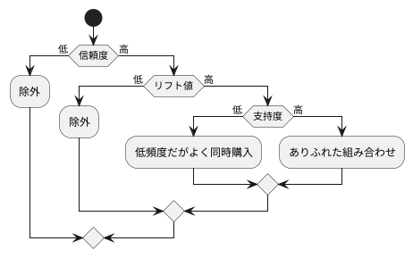
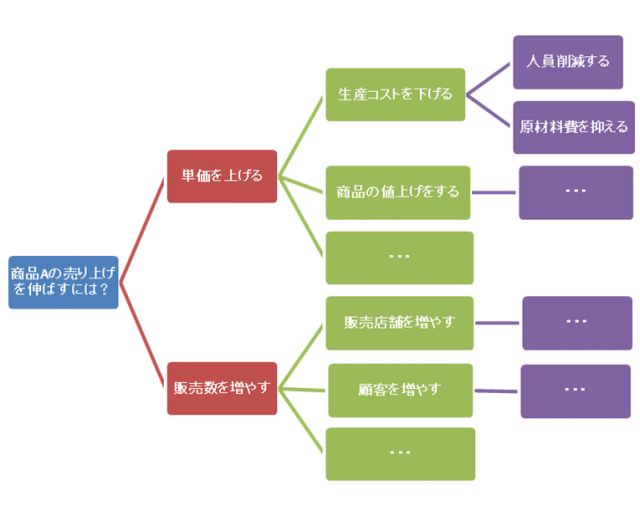

# Dr.Sumで業務分析

- [Dr.Sumで業務分析](#drsum%E3%81%A7%E6%A5%AD%E5%8B%99%E5%88%86%E6%9E%90)
  - [分析の流れ](#%E5%88%86%E6%9E%90%E3%81%AE%E6%B5%81%E3%82%8C)
  - [具体的な分析手法・顧客と商品分析](#%E5%85%B7%E4%BD%93%E7%9A%84%E3%81%AA%E5%88%86%E6%9E%90%E6%89%8B%E6%B3%95%E3%83%BB%E9%A1%A7%E5%AE%A2%E3%81%A8%E5%95%86%E5%93%81%E5%88%86%E6%9E%90)
    - [RFM分析](#rfm%E5%88%86%E6%9E%90)
    - [デシル分析](#%E3%83%87%E3%82%B7%E3%83%AB%E5%88%86%E6%9E%90)
    - [セグメント分析](#%E3%82%BB%E3%82%B0%E3%83%A1%E3%83%B3%E3%83%88%E5%88%86%E6%9E%90)
    - [ランキング分析](#%E3%83%A9%E3%83%B3%E3%82%AD%E3%83%B3%E3%82%B0%E5%88%86%E6%9E%90)
    - [ABC分析](#abc%E5%88%86%E6%9E%90)
    - [バスケット分析](#%E3%83%90%E3%82%B9%E3%82%B1%E3%83%83%E3%83%88%E5%88%86%E6%9E%90)
  - [具体的な分析手法・在庫分析](#%E5%85%B7%E4%BD%93%E7%9A%84%E3%81%AA%E5%88%86%E6%9E%90%E6%89%8B%E6%B3%95%E3%83%BB%E5%9C%A8%E5%BA%AB%E5%88%86%E6%9E%90)
    - [ABC分析](#abc%E5%88%86%E6%9E%90-1)
    - [在庫回転率分析](#%E5%9C%A8%E5%BA%AB%E5%9B%9E%E8%BB%A2%E7%8E%87%E5%88%86%E6%9E%90)
  - [具体的な分析手法・財務分析](#%E5%85%B7%E4%BD%93%E7%9A%84%E3%81%AA%E5%88%86%E6%9E%90%E6%89%8B%E6%B3%95%E3%83%BB%E8%B2%A1%E5%8B%99%E5%88%86%E6%9E%90)
    - [収益性分析](#%E5%8F%8E%E7%9B%8A%E6%80%A7%E5%88%86%E6%9E%90)
    - [達成率分析](#%E9%81%94%E6%88%90%E7%8E%87%E5%88%86%E6%9E%90)
      - [`KPI`とは](#kpi%E3%81%A8%E3%81%AF)
  - [RFMの出し方](#rfm%E3%81%AE%E5%87%BA%E3%81%97%E6%96%B9)

## 分析の流れ

1. 目的と分析手法を決定
   - 「売り上げを伸ばしたい」は抽象的で大きすぎる目標
     - 商品の陳列を見直したい
     - 来客数を増やしたい  
    等のより詳細な目的に落とし込む必要がある
2. 分析手法の決定
   - 顧客分析
   - 商品分析
   - 在庫分析
   - 財務分析
   - 達成度分析  
    これらの手段を目的の達成の為に用いる
    ユースケース図でやることをはっきりさせる

-----

## 具体的な分析手法・顧客と商品分析

例えば

Q: 売れ筋を知りたい  
A: 一定期間内の売り上げデータを売り上げ数量で降順ソート

※将来を予測する分析手法には
- 指数平滑法
- 移動平均法

等がある

----

### RFM分析

顧客分析の一つで、次の３つの尺度でランク分けする
- Recency
  - 最終購入日
- Frequencey
  - 累計購入回数
- Monetary
  - 累計購入金額

一般的にはこれらの次元毎に５ランク程度に分ける  
尺度は自由である

必要なデータは
- 顧客識別情報（ID等）
- 購入日
- 購入金額

※RFMから一歩進んで、RFMC分析という分析手法もある
- Cluster, 顧客クラスター
- Category, 商品カテゴリ

### デシル分析

RFMより手っ取り早い手法

- 売り上げを上から並べて10等分し
- 上位何％の顧客の売上が全体の何％を占めるかを確認する

>※パレートの法則  
一般的に、上位20％の顧客の売上が全体の80％を占める  
**パレート図**はデシル分析の為に用いる

### セグメント分析

顧客の**属性**も加えて顧客を分析する

属性の組み合わせは多岐にわたるので、
- 事前に当たりを付けるか
- クラスター分析を用いて類似のデータを自動分類する

必要がある。

主なセグメントとして、
- 年齢
- 地域
- 給与帯
- 家族構成
- 職業

等々

>結果から意味のあることを導き出すのは難しい  
意味のある結果がでても、そのセグメント自体の大きさは  
また別に考えなければならない

### ランキング分析

トップ10とかワースト10とかを出す

### ABC分析

売上金額や利益などの重要度に応じて商品を分類し、  
重要度の高いものとそうでないものを選別する

目的として、
- 全体を管理するのではなく
- 取捨選択をし
- 効率化を図る

ときが良い

ABCの分け方  
明確な決まりは無いが、
1. 上位70%をA
2. 70% ~ 90%をB
3. 90% ~ 100%をC

と分ける場合が多い

ABC分析でも、パレート図がよく用いられる

### バスケット分析

あわせ買いの対象を知りたい！！

知れれば、おすすめとしてリコメンドしたり、セットとして販売することで売り上げ増加を図れる

ただし、単品でもよく売れる商品は除外する必要がある

結果をどの程度信用できるかという指標として
- 信頼度
- 支持度
- リフト値
  
という３つの値を使用する

- 信頼度
  - 商品Aを買ったときに商品Bを買う確率
- 支持度
  - 売上全体の中で商品Aと商品Bの同時購入の確率
- リフト値
  - 商品A, Bを同時購入する確率が、商品B単体の場合と比べて何倍か
  - 信頼度 / 商品Bの支持度 (B購入数 / 全体の購入数)
  - リフト値は1より大きければ有効

分析結果の見方



おにぎりとお茶など、ありふれた組み合わせを見つけるだけでは  
意味がない

-----

## 具体的な分析手法・在庫分析

過剰な在庫は
- 売上チャンスを逃がしたり
- 保管コストや廃棄コストも生む
- Amazonにはかなわない

### ABC分析

商品分析で使うABC分析は、在庫管理にもよく用いられる  
在庫管理での重要度には
- 仕入単価✖数量

がよく使われる

重要度の高いAグループは、
- 重点管理項目
- 重要管理品目
とか呼ばれる

### 在庫回転率分析

在庫が入れ替わる速さを分析し、  
在庫量の適正化を図る

>在庫 = 棚卸資産 でもあるので  
棚卸資産回転率や商品回転率とも呼ぶ

必要なデータ
- 売上原価
- 期首と期末の在庫金額

----

## 具体的な分析手法・財務分析

以下の財務諸表を使って分析する
- 貸借対照表（バランスシート）
- 損益計算書
- キャッシュフロー計算書

### 収益性分析

利益と売上の比率をもとに、収益の効率性をみる

同業他社と比較しなければ意味が無い数字なので、  
省略！！

### 達成率分析

目標を立てたとき、それが達成できそうかどうかを  
終わる前に知りたい！

#### `KPI`とは

Key Performance Indicators  
    : 重要業績評価指数
- 目標をいくつかのステップに分割して、中間目標をたてる

ロジックツリー(※1)やプロセスマップ(※2)を使う

※1 ロジックツリー


※2 プロセスマップ  
: フローチャートみたいなやつ

    
>KPIは応用が利くので、適切に設定するのは困難である  
必要に応じて見直さなければならない

----

## RFMの出し方

各要素を普通は５ランクに分ける。  
この際、ランクの重みづけは`適切`に設定しないといけない

|ランク|購入日 (間隔：9日)|購買件数（間隔：約12件）|売上金額
|-|-|-|-|
|1|～ 20170603|～67 | ～980058
|2|～ 20170612|～79 |～1267026
|3|～ 20170621|～91 |～1553994
|4|～ 20170630|～103|～1840962
|5|20170701 ～|104～|184093～

- 購入年月日を６桁の数字にして減算可能にし、decode関数をランク数ぶんネストさせる力技
- 最後の`-1`はデフォルト値では無く、ネストさせている部分に該当する

```SQL

SELECT TBL1.顧客ID,
	decode(sign(MAX(TBL1.購入年月日) - 20170630), 1, 5, 0, 5, -1,
	decode(sign(MAX(TBL1.購入年月日) - 20170621), 1, 4, 0, 4, -1,
	decode(sign(MAX(TBL1.購入年月日) - 20170612), 1, 3, 0, 3, -1,
	decode(sign(MAX(TBL1.購入年月日) - 20170603), 1, 2, 0, 2, -1, 1)))),

  decode(sign(COUNT(DISTINCT TBL1.購入年月日) - 103), 1, 5, 0, 5, -1,
  decode(sign(COUNT(DISTINCT TBL1.購入年月日) - 91),  1, 4, 0, 4, -1,
  decode(sign(COUNT(DISTINCT TBL1.購入年月日) - 79),  1, 3, 0, 3, -1,
  decode(sign(COUNT(DISTINCT TBL1.購入年月日) - 67),  1, 2, 0, 2, -1, 1)))),

  decode(sign(SUM(TBL1.売上金額) - 1840962), 1, 5, 0, 5, -1,
  decode(sign(SUM(TBL1.売上金額) - 1553994), 1, 4, 0, 4, -1,
  decode(sign(SUM(TBL1.売上金額) - 1267026), 1, 3, 0, 3, -1,
  decode(sign(SUM(TBL1.売上金額) - 980058),  1, 2, 0, 2, -1, 1)))),

	decode(sign(MAX(TBL1.購入年月日) - 20170630), 1, 5, 0, 5, -1,
	decode(sign(MAX(TBL1.購入年月日) - 20170621), 1, 4, 0, 4, -1,
	decode(sign(MAX(TBL1.購入年月日) - 20170612), 1, 3, 0, 3, -1,
	decode(sign(MAX(TBL1.購入年月日) - 20170603), 1, 2, 0, 2, -1, 1))))
  +
  decode(sign(COUNT(DISTINCT TBL1.購入年月日) - 103), 1, 5, 0, 5, -1,
  decode(sign(COUNT(DISTINCT TBL1.購入年月日) - 91),  1, 4, 0, 4, -1,
  decode(sign(COUNT(DISTINCT TBL1.購入年月日) - 79),  1, 3, 0, 3, -1,
  decode(sign(COUNT(DISTINCT TBL1.購入年月日) - 67),  1, 2, 0, 2, -1, 1))))
  +
  decode(sign(SUM(TBL1.売上金額) - 1840962), 1, 5, 0, 5, -1,
  decode(sign(SUM(TBL1.売上金額) - 1553994), 1, 4, 0, 4, -1,
  decode(sign(SUM(TBL1.売上金額) - 1267026), 1, 3, 0, 3, -1,
  decode(sign(SUM(TBL1.売上金額) - 980058),  1, 2, 0, 2, -1, 1)))),
  1
FROM
  V売上実績（商品名）ビュー TBL1
GROUP BY
  TBL1.顧客ID

```
