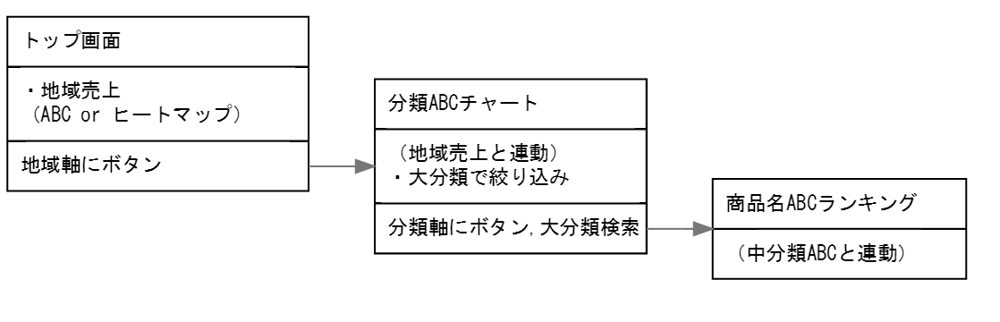

# guiflow

レイアウトを考えたり、必要な機能を列挙するのに`紙に書く`以外で楽な方法は無いか

>[もう保守されない画面遷移図は嫌なので、UI Flow図を簡単にマークダウンぽく書くエディタ作った](https://qiita.com/hirokidaichi/items/ff54a968bdd7bcc50d42)

これを使えばMarkDownで画面遷移図が書ける。  
非常に楽である。

イメージ


中身

```md
[トップ画面]
・地域売上
    （ABC or ヒートマップ）
-
地域軸にボタン

==>分類ABCチャート

[分類ABCチャート]
（地域売上と連動）
・大分類で絞り込み
-
分類軸にボタン
大分類検索

==>商品名ABCランキング

[商品名ABCランキング]
（中分類ABCと連動）
```
