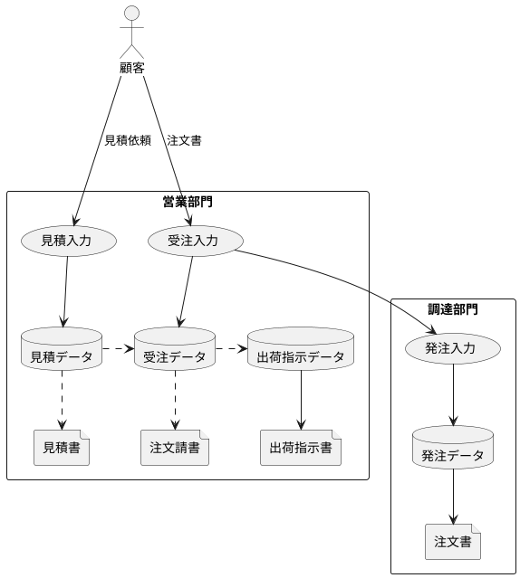

# 販売管理システム

データを取り出す側として、基本的な設計思想や業務内容に基づいたDB構成等を知っておきたい

## 使うもの

- 書籍
  - グラス片手にデータベース設計

----

## 販売管理システムの基本構成

>販売管理は「会計」や「人事」と同じように、全ての企業に共通するもの

```
基幹業務≠会計関連業務
基幹業務＝企業内の主業務
```

業種や企業によって当然異なるが、まったく違うわけではない

