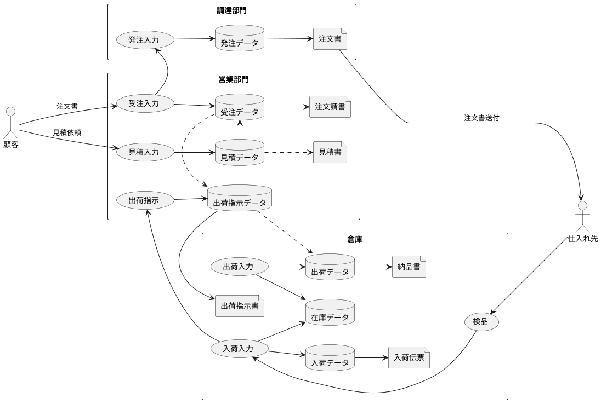

# 販売管理システム

- [販売管理システム](#%E8%B2%A9%E5%A3%B2%E7%AE%A1%E7%90%86%E3%82%B7%E3%82%B9%E3%83%86%E3%83%A0)
  - [使うもの](#%E4%BD%BF%E3%81%86%E3%82%82%E3%81%AE)
  - [販売管理システムの基本構成](#%E8%B2%A9%E5%A3%B2%E7%AE%A1%E7%90%86%E3%82%B7%E3%82%B9%E3%83%86%E3%83%A0%E3%81%AE%E5%9F%BA%E6%9C%AC%E6%A7%8B%E6%88%90)

データを取り出す側として、基本的な設計思想や業務内容に基づいたDB構成等を知っておきたい

## 使うもの

- 書籍
  - グラス片手にデータベース設計

----

## 販売管理システムの基本構成

>販売管理は「会計」や「人事」と同じように、全ての企業に共通するもの

```
基幹業務≠会計関連業務
基幹業務＝企業内の主業務
```

業種や企業によって当然異なるが、まったく違うわけではない


- 見積管理
  - これをシステムに含めると、`採算計算書`として兼用できる
    - 受注の際と照らし合わせることで、チェックできる。
  - 特定の業者と定常的な取引をする場合、都度の見積は不要のケースもある
- 受注管理
  - 誰が何の為に見る帳簿なのかを想定すること
    - 個別案件の傾向が強い場合、「この業者からこの値段で…」というチェック
    - 決まりきった注文を数多くこなす場合、バシバシ入力して自らチェック
  - 在庫がある商品の場合、受注の際に`在庫引当処理`も同時に行う
    - 商品に売却済みフラグを立てる
    - 受注時に在庫が無い場合、不足分を発注業務に連動させる
    - しきい値を設定して、自動処理も考えられる
- 発注管理
  - 発注には以下の２通りの型がある
    - 受注連動型
      - 受注のあった分だけ発注する
    - 見込発注型
      - 需要予測に基づいて、あらかじめ手配しておく
  - 今回は後者のパターン
  - 最近の主流
    - 在庫を抱えないため、安全在庫数が少なく発注頻度が高い
    - 輸送コストを抑えるため、自社倉庫に納入するのではなく`直送`する
      - 直送する場合、発注入力の際に住所等の顧客情報を盛り込む必要がある
