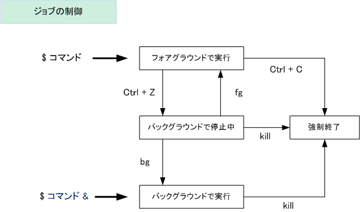

# プロセスのコマンド

- `ps` : プロセス表示

    |STATの一文字目|意味
    |-|-|
    |D|スリープ ( CPU放棄 )、割り込み不可の状態 ： I/O待ち
    |R|実行可能 ( CPU使用中、使用可能 )
    |S|スリープ ( CPU放棄 )、割り込み可能な状態 ： キー入力待ち
    |T|停止状態
    |Z|プロセス終了済み状態 ： 但し、親プロセスの処理待ち

- `top` : プロセスリアルタイム表示
- `kill` : プロセス削除
- `uptime` : システム稼働時間

## ジョブ

プロセス実行中のことを`ジョブ`と呼ぶ

ジョブには  
- フォアグラウンド
- バックグラウンド

の二つある。

フォアグラウンドのジョブは終わるまでシェルを占有するので、
時間がかかるジョブはバックグラウンドで実行(` command &`)させる

ジョブ一覧は`jobs`で確認できる

|ジョブ制御|説明|
|-|-|
!Ctrl + C|フォアグラウンドのジョブを強制終了
!Ctrl + Z|フォアグラウンドジョブを、バックグラウンドジョブの停止状態へ移行
!bg|バックグラウンドで停止中のジョブを実行状態にする
!fg|バックグラウンドジョブをフォアグラウンドジョブに変更する

※引用：[Linux - プロセスの生成、監視、終了（フォアグラウンドとバックグラウンド）](https://www.infraeye.com/study/linuxz17.html)
