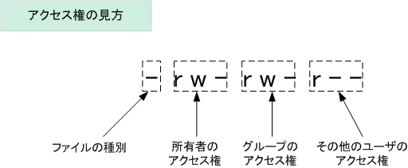

# ファイルシステムとパーミッション

## Linuxのパーミッション

### chmod

>**ch**ange **mod**e

- 所有者
- グループ
- その他

３つの分類で

- **R**ead : 読み込み
- **W**rite : 書き込み
- e**X**cute : 実行

３種類のアクセス権を設定する

ファイルにread権限があっても、ファイルが存在する  
ディレクトリにexcute権限がなければ読み込めないので注意



|記号表記|2進数|8進数
|-|-|-|
|---|000|0
|--x|001|1
|-w-|010|2
|-wx|011|3
|r--|100|4
|r-x|101|5
|rw-|110|6
|rwx|111|7

アクセス権の設定は`chmod`で行う

```
chmod [-R (Dir再帰指定)] 755 filename
```

### SUID

UID = ユーザを管理するID

一時的に別のUIDに変更できる機能のことを`SUID` (Set User ID)と呼ぶ

SUIDが設定されている場合、所有者パーミッションの`x`にあたる部分が`s`と表記される。

```
# ls -la | grep passwd
-rwsr-xr-x   1 root root     78272 10月 31 01:33 gpasswd
-rwsr-xr-x   1 root root     27832  6月 10  2014 passwd
```

`chmod`でSUIDを付与する場合、`4000`を加算する

ユーザー単位ではなくグループ単位で付与する場合、  
`SGID`と呼び、アクセス権は`2000`を加算する

#### スティッキービット

>スティッキービット（Sticky bit）が設定されたディレクトリ以下のファイルとディレクトリは、実際に設定したアクセス権に関係なくて、所有者とrootユーザのみが名前の変更と削除を行えます。  
このスティッキービットが使用されるケースは「全ユーザーがファイルを作成できるが作成したファイルを他人がファイル名の変更や削除をできないようにしたい」場合です。

付与するには、アクセス権に`1000`を加算する。  
設定すると、他のユーザーの実行権限が`t`となる

----

### chown

>**ch**ange **own**er

所有者を変更する。rootのみが実行可

```
# chown [ユーザー][:グループ] filename
```

### chgrp

> **ch**ange **gr**ou**p**

グループを変更する。

```
# chgrp グループ filename
```

## シンボリックリンクとハードリンク

(WinXPでも使えていたので概念は割愛)

どちらを作成するにも`ln`を使う

```
$ ln [-s (シンボリックリンク作成)] リンク元 リンク先
```

例：

```
$ ln -s Dockerfile linkfile
$ ls -la
-rw-r--r-- 1 root root  934  2月 25 11:34 Dockerfile
lrwxrwxrwx 1 root root   10  2月 26 13:20 linkfile -> Dockerfile
```

シンボリックリンク作成後は、アクセス権の最初が`l`になり  
`ファイル名 -> リンク元` と表示される
